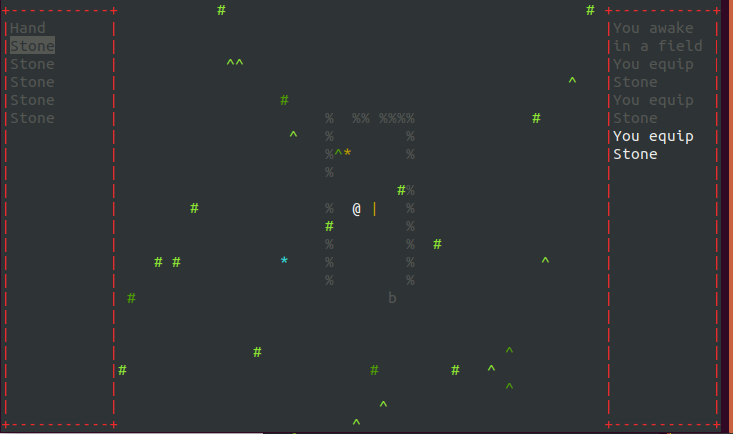

# rogue-like
A proof of concept 'game' using an ascii game engine I wrote.

## Screenshot


## Install and Run
```bash
# make sure you have curses installed before you run
git clone https://github.com/adam-mcdaniel/rogue-like

cd rogue-like
python main.py
```
